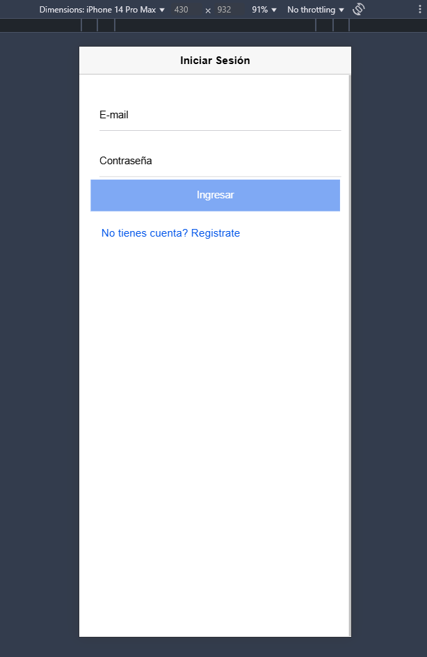
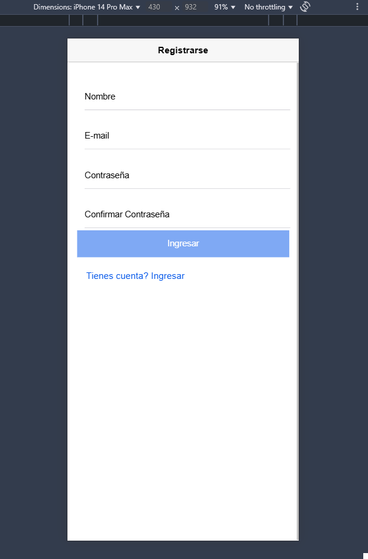
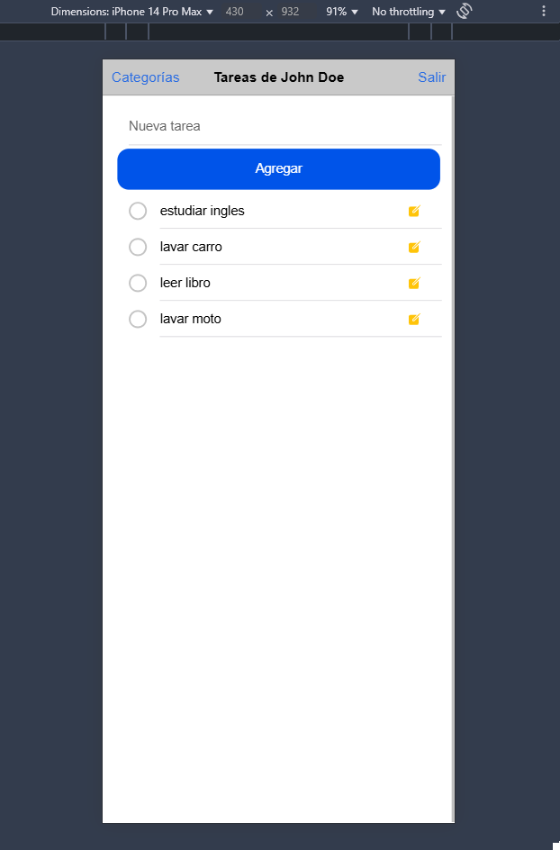
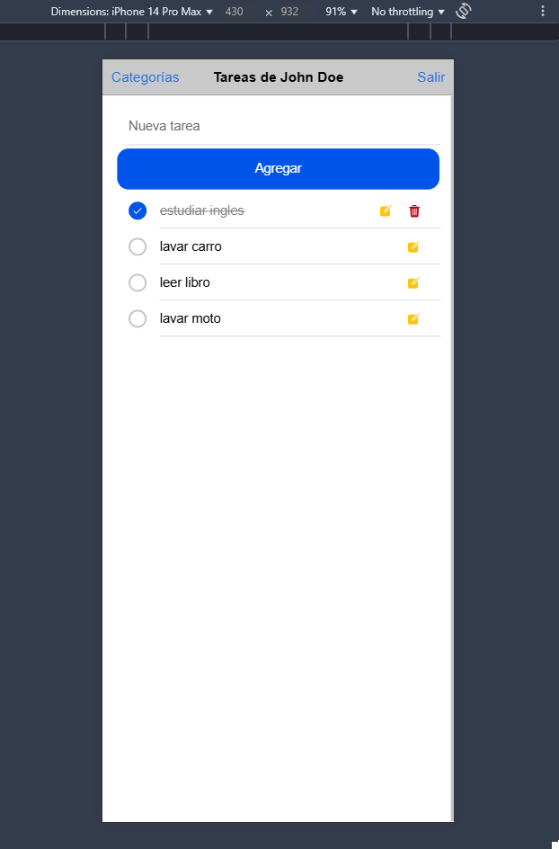
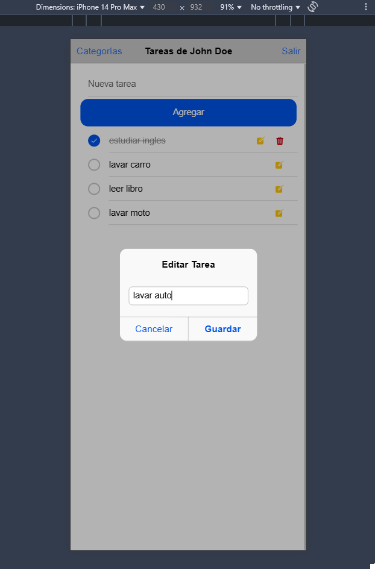

# Ionic App To Do List

## Description

This is a simple To Do List application built with Ionic Framework. It allows users to add, edit, and delete tasks. The app is designed to be user-friendly and responsive, making it suitable for both mobile and web platforms.

## Features

- Add new tasks
- Edit existing tasks
- Delete tasks
- Mark tasks as completed
- Add Categories to tasks
- Edit Categories
- Delete Categories

#### Login

- Login with username and password

#### Register

- Register a new user

#### Tasks

- View all tasks

#### Task Completed

#### Task Edit

#### Author

- [Raul Bolivar | GitHub](https://github.com/raulrobinson/ionic-to-do-list)

### License

This project is licensed under the MIT License - see the [LICENSE](LICENSE) file for details.

